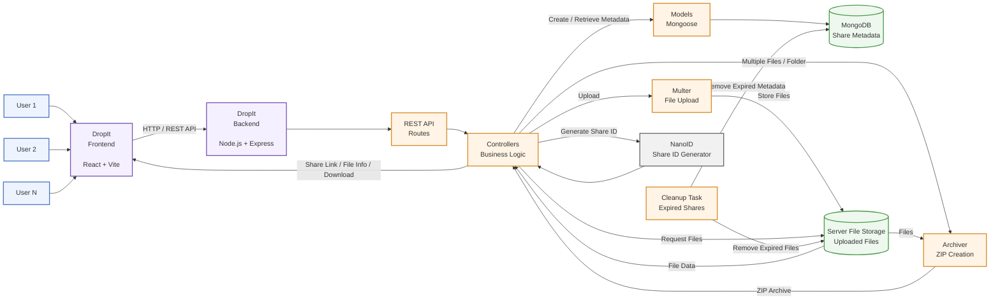

# 🚀 DropIt

DropIt is a full-stack file sharing application that allows users to upload files or complete folders and share them through a unique link.

The application is built with a **React frontend** and a modular **Node.js + Express backend**, with MongoDB used for storing share metadata and server-side storage used for the actual uploaded files.

---

## ✨ Features

* 📄 Upload single or multiple files
* 📁 Upload complete folders
* 🔗 Generate unique shareable links
* ⬇️ Download shared files and folders
* 📦 Automatic ZIP creation for folder downloads
* 🧹 Automatic cleanup of expired shares
* 📱 Responsive user interface
* 🔌 RESTful API architecture
* 🏗️ Modular MVC backend architecture

---

## 🛠️ Tech Stack

### Frontend

* React
* Vite
* CSS
* Axios

### Backend

* Node.js
* Express.js
* MongoDB
* Mongoose
* Multer
* Archiver
* NanoID

---

## 📂 Project Structure

```text
DropIt
├── frontend
│   ├── src
│   └── public
│
├── backend
│   ├── src
│   │   ├── controllers
│   │   ├── db
│   │   ├── middlewares
│   │   ├── models
│   │   ├── routes
│   │   ├── tasks
│   │   ├── utils
│   │   ├── app.js
│   │   └── index.js
│   │
│   ├── public
│   ├── .env
│   └── package.json
│
└── README.md
```

---

## 🚀 Getting Started

### Prerequisites

Make sure you have the following installed:

* Node.js
* npm
* MongoDB or a MongoDB Atlas database
* Git

### Clone the Repository

```bash
git clone https://github.com/<your-username>/dropit.git
cd dropit
```

### Install Frontend Dependencies

```bash
cd frontend
npm install
```

### Install Backend Dependencies

```bash
cd ../backend
npm install
```

---

## ⚙️ Environment Variables

Create a `.env` file inside the `backend` directory:

```env
PORT=5000
MONGODB_URI=your_mongodb_connection_string
```

Make sure `.env` is included in `.gitignore` and is **not committed to GitHub**.

---

## ▶️ Run the Project

### Start the Backend

Open a terminal:

```bash
cd backend
npm run dev
```

The backend server will run on:

```text
http://localhost:5000
```

### Start the Frontend

Open another terminal:

```bash
cd frontend
npm run dev
```

Vite will provide the local frontend URL in the terminal, usually:

```text
http://localhost:5173
```

---

## 📖 How It Works

1. The user selects one or more files or an entire folder.
2. The React frontend sends the files to the backend using Axios.
3. Express routes the request to the appropriate controller.
4. Multer processes the uploaded files and stores them on the server.
5. File metadata is stored in MongoDB using Mongoose.
6. NanoID generates a unique share ID.
7. The share ID is used to create a shareable link.
8. Another user can use the link to retrieve the shared file information.
9. Files can be downloaded individually.
10. When multiple files or a folder are downloaded, Archiver creates a ZIP archive.
11. A scheduled cleanup task removes expired share metadata and associated files.

---

## 🏛️ Backend Architecture

DropIt's backend follows the **MVC (Model–View–Controller)** architecture.

### Controllers

Handle incoming requests and application business logic.

### Models

Define MongoDB schemas and interact with the database using Mongoose.

### Routes

Define API endpoints and map requests to the appropriate controllers.

### Middlewares

Handle request processing, validation, file uploads, and other reusable request-level operations.

### Tasks

Execute scheduled background operations such as removing expired shares and their associated files.

### DB

Contains the MongoDB connection configuration.

### Utils

Contains reusable helper functions used throughout the backend.

---

## 🏗️ System Architecture



### Architecture Overview

| Component        | Responsibility                               |
| ---------------- | -------------------------------------------- |
| **React + Vite** | User interface and file-sharing interactions |
| **Axios**        | Sends HTTP requests to the backend           |
| **Express**      | Handles the REST API                         |
| **Routes**       | Maps API endpoints to controllers            |
| **Controllers**  | Handles application logic                    |
| **Mongoose**     | Communicates with MongoDB                    |
| **MongoDB**      | Stores share and file metadata               |
| **Multer**       | Processes file uploads                       |
| **File Storage** | Stores the actual uploaded files             |
| **NanoID**       | Generates unique share IDs                   |
| **Archiver**     | Creates ZIP archives                         |
| **Cleanup Task** | Removes expired shares and files             |

---

## 💾 Data Storage

DropIt separates **file storage** from **metadata storage**.

### MongoDB

MongoDB stores information about the shared files, such as:

* Share ID
* Original filename
* File path
* File size
* MIME type
* Total size
* Creation/expiration information
* Information about multiple files

### Server File Storage

The actual uploaded files are stored on the server.

For example:

```text
Server File Storage
├── share-abc123
│   ├── resume.pdf
│   └── photo.jpg
│
└── share-x7k92p
    └── project-folder
        ├── index.html
        ├── style.css
        └── script.js
```

MongoDB stores the **metadata and references**, while the server stores the **actual files**.

---

## 📡 API Endpoints

| Method | Endpoint                       | Description                      |
| ------ | ------------------------------ | -------------------------------- |
| `POST` | `/api/share/upload`            | Upload files or folders          |
| `GET`  | `/api/share/:shareId`          | Retrieve shared file information |
| `GET`  | `/api/share/download/:shareId` | Download shared files            |

---

## 🔄 File Sharing Flow

### Upload

```text
User
  ↓
React Frontend
  ↓
Axios
  ↓
Express API
  ↓
Controller
  ↓
Multer
  ↓
Server File Storage
```

At the same time, metadata is stored:

```text
Controller
    ↓
Mongoose
    ↓
MongoDB
    ↓
Share Metadata
```

### Sharing

```text
Upload
  ↓
NanoID
  ↓
Unique Share ID
  ↓
Shareable Link
  ↓
Other User
```

### Download

```text
User
  ↓
Shareable Link
  ↓
React Frontend
  ↓
Express API
  ↓
Controller
  ↓
MongoDB
  ↓
Find File Metadata
  ↓
Server File Storage
  ↓
Download
```

### Folder Download

```text
Multiple Files
      ↓
   Archiver
      ↓
  ZIP Archive
      ↓
    Download
```

---

## 🧹 Automatic Cleanup

DropIt includes a scheduled cleanup task that removes expired shares.

```text
Cleanup Task
     │
     ├──→ MongoDB
     │     └── Remove expired metadata
     │
     └──→ File Storage
           └── Remove associated files
```

This prevents expired files from unnecessarily consuming server storage.

---

## 🔮 Future Improvements

* 🔐 User authentication
* 🔑 Password-protected share links
* 📊 Upload progress indicator
* ☁️ Cloud storage integration
* 👁️ File previews
* 📈 Download analytics
* 📱 QR code sharing
* ⏱️ Configurable link expiration

---

## 🤝 Contributing

Contributions are welcome.

1. Fork the repository.
2. Create a feature branch.

```bash
git checkout -b feature/your-feature
```

3. Commit your changes.

```bash
git commit -m "Add your feature"
```

4. Push your branch.

```bash
git push origin feature/your-feature
```

5. Open a Pull Request.

---

## 👨‍💻 Author

**Saurabh**

If you found this project helpful, consider giving it a ⭐ on GitHub.
